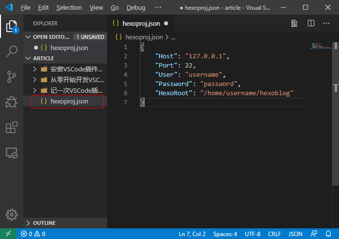
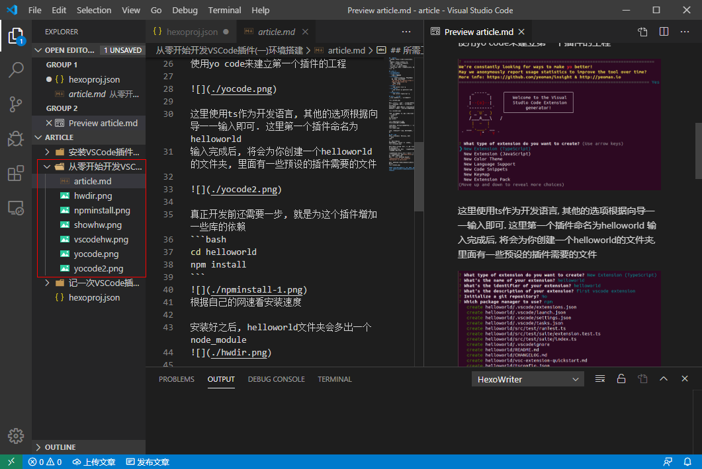
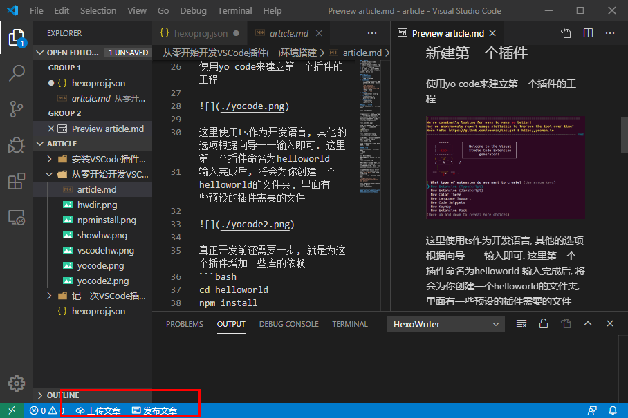
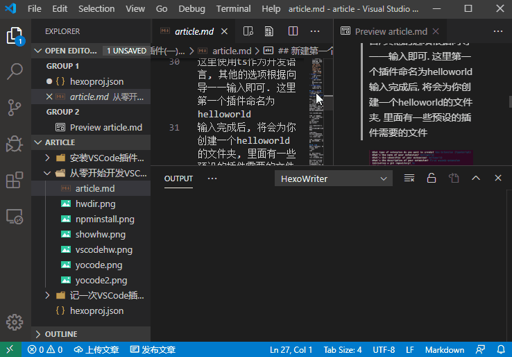

## 前言
很久没写blog了，心血来潮注册了个域名和空间，一开始选了zblog， 但是支持不够，后来换wordpress， 想改代码发现已经不懂php了， 最后还是选定了hexo, 不过hexo写文章加图片真是太反人类了，即使安装了插件，图片放在同名目录下， md里引用却不能使用这个目录名， 要当同目录引用，都不用考虑本地写作的吗？
遂做了这个插件， 方便本地VSCode编辑文章时， 可以即时预览，也方便发布文章后，不用修改图片的路径。一举两得。

## 使用方法

安装本插件后，需要新建一个工程文件"hexoproj.json"
该文件用于配置远程服务器的信息



```Json
{
    "Host": "127.0.0.1",
    "Port": 22,
    "User": "username",
    "Password": "password",
    "HexoRoot": "/home/username/hexoblog"
}
```
- Host: 远程主机的IP信息
- Port: 远程主机的SSH2开放的端口
- User: 有权限写blog的用户名
- Password: 密码
- HexoRoot: 你的hexo blog的根目录

## 如何写作


写作对目录结构有一定的要求，每一篇文章都是一个文件夹，文章的内容都必须写在article.md里，文章用到的图片，放在和md同目录下，编辑时，就可以直接预览的，如上图所示。

## 如何上传文章

当打开的目录里包含了hexoproj.json文件时，就会激活插件，在UI的左下方会有2个按钮，一个是上传文章，一个是发布，上传文章只是提交倒hexo_root/source/_post, 需要上传完毕后再点发布，才会生成静态页面



上传完成并发布后，远端的hexo就会可以访问。如果你的博客不是发布后就可以看到，你可能还得拷贝到可以看到的地方。

## 未来功能
未来会持续完善功能，欢迎有使用本插件的朋友多给我反馈和建议。

## 反馈
可以直接在 https://github.com/xiongyu/hexowriter/issues 反馈

也可以来我的博客（非常好玩）进行反馈
[HTTP://FeiChangHaoWan.COM](http://FeiChangHaoWan.COM "非常好玩")

**Enjoy**